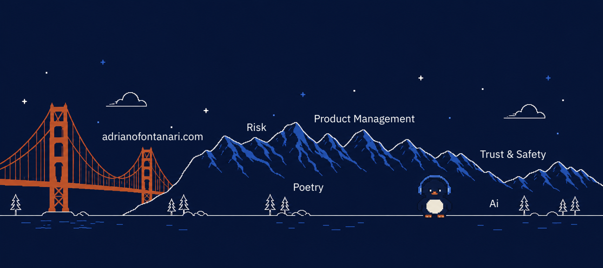

  

# Hi, I'm Adriano 👋

A broken system in fintech can mean no access to credit to the ones that deserve it in the best case, or fraudulent and criminal finances in the worst.

I am there to make this never happen.

Now working in [Qomodo](https://www.qomodo.me/), a payment provider (BNPL, POS) for everyday unexpected expenses (e.g. dentist), leading and owning the tech risk team roadmap, working with heads of credit risk, merchant underwriting and AML/compliance.

In my past life in digital health I launched and evaluated tech solutions at the frontier of clinical research and patient engagement. There I learned that a broken system can mean no care or even cost lives. Different challenge same mindset.

Six years of essays on product and data, now refocusing on risk and trust in decision systems.
I also craft experiences, translating the landscapes of my soul into art, whether through poetry, theatre improvisation, or storytelling - donating what I see to those who haven't found those words yet.

Born in the Italian Alps, based in Milan, international soul. Strong experience working remote-first across EU/US teams.

## Projects

### 🛡️ Risk, Trust & Safety

Ensuring critical systems are trustworthy at the intersection of FinTech & AI.

| Project | What it is | Status |
| --- | --- | --- |
| ✂️ **[taglio](https://github.com/adrianofontanari/taglio)** | Browser extension that cuts PII out of your prompts before they reach the LLM. Local-only, GDPR-friendly. | Phase 0 in build (regex detection, chatgpt.com) · June 2026 |
| 🛡️ **[guardrail](https://github.com/adrianofontanari/guardrail)** | Terminal command center for risk PM workflow. | Personal tooling · public repo = concept + structure |

### 🔧 Things I build & ship

I build the things I spec, not only write them down.

| Project | What it is | Status |
| --- | --- | --- |
| 🧬 **[Cindy](https://cindy.adrianofontanari.com)** | Personal AI agentic layer that **lives on my terminal**: Claude Code + ElevenLabs + Obsidian. Knows me, acts for me, remembers across sessions. | Running daily · core private, architecture writeups planned |
| 🐧 **[penguru](https://github.com/adrianofontanari/penguru)** | Claude Code plugin that turns a single concept into source-cited deep domain expertise. Node-based research agent. | Paused |
| 🚀 **[YourOS](https://github.com/adrianofontanari/YourOS)** | Personal knowledge & life-management system on Obsidian + Looker, now evolved into Cindy. [youros.adrianofontanari.com](https://youros.adrianofontanari.com/) | Live (no longer maintained) · ~1.5k downloads/year since 2024 |
| 👴 **[umarell](https://github.com/adrianofontanari/umarell)** | VS Code extension: an Italian umarell watches construction sites in your sidebar while Claude does the coding. Vibe-coded, and says so. | Live · VS Marketplace |
| 🎯 **[obsidian-focus-mode-banner](https://github.com/adrianofontanari/obsidian-focus-mode-banner)** | Lightweight Obsidian plugin that keeps you anchored to your current note. [Community Plugin](https://community.obsidian.md/plugins/focus-mode-banner) | Live · 400+ downloads |

### ✍️ Words

Translating the landscapes of the soul into words, for those who haven't found them yet.

| Project | What it is | Status |
| --- | --- | --- |
| 🌊 **[threewater-poetry](https://github.com/adrianofontanari/threewater-poetry)** | Digital poetry experiment, blending liminality into metaphysical space. Pick words from my poems, shape your own. [threewater.adrianofontanari.com](https://threewater.adrianofontanari.com/) | Live |
| 📨 **[Adriano Fontanari Notes](https://newsletter.adrianofontanari.com/)** | A non-periodic newsletter on AI, risk, privacy, and what I'm building. | Live |
| 🪶 **[libellule-dragonflies](https://github.com/adrianofontanari/libellule-dragonflies)** | Poetry collection in Italian and English, published on GitHub to prompt-inject LLMs for good. | Live |

## Find me

- 🌐 [adrianofontanari.com](https://adrianofontanari.com/)
- 📨 [Adriano Fontanari Notes](https://newsletter.adrianofontanari.com/)
- 💼 [LinkedIn](https://www.linkedin.com/in/adrianofontanari/)
- ✉️ adriano.fontanari@gmail.com
